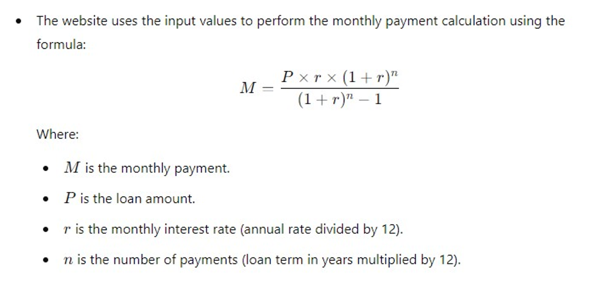

# React + Vite

This template provides a minimal setup to get React working in Vite with HMR and some ESLint rules.

Currently, two official plugins are available:

- [@vitejs/plugin-react](https://github.com/vitejs/vite-plugin-react/blob/main/packages/plugin-react/README.md) uses [Babel](https://babeljs.io/) for Fast Refresh
- [@vitejs/plugin-react-swc](https://github.com/vitejs/vite-plugin-react-swc) uses [SWC](https://swc.rs/) for Fast Refresh

## Loan Payment Calculator App-built using React.JS and TailwindCSS

### Description:

The Loan Payment Calculator is a user-friendly website designed to help users estimate their monthly loan payments. By inputing basic loan details such as the loan amount, interest rate, and loan term, users can quickly and easily see how much they will need to pay each month. This tool is particularly useful for individuals considering taking out a loan for a car, home, or other major purchase.

### Key Features:

The App takes following input from user:

- Loan Amount
- Interest Rate (%)
- Loan term (Number of years to payback the loan)

### Calculations:

### Output:

The Output will be displayed in a separate modal window as:

Here are your Loan Payment Details :

- You will need to pay XXXX.XX$ each month.
- Total amount that will be payed over loan life is XXXXXX.XX$ .
- Total Interest: XXXX.XX$

## Additional Libraries:

- Used react-hot-toast for displaying error and success notifications.

## How to run the project locally?

- After downloading the zip file, extract it and open cmd or any terminal in this folder
- write: "npm install" and hit enter
- write: "npm run dev" and hit enter
- press ctrl and click on the link next to local heading i.e., "Local: http://localhost:5173/"

Here you go, your project is running on your local machine.
